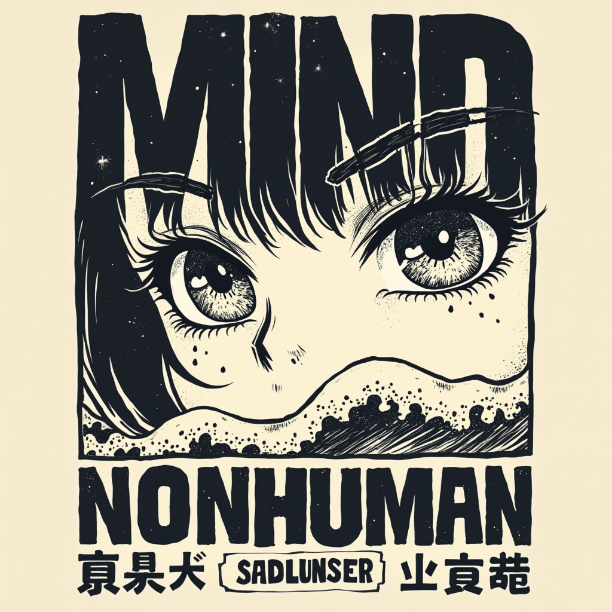

# MIND  

  

**Welcome to MIND**, a repository designed to help you explore and understand the core concepts of Vision Language Action Models (VLAs).
The beauty of this kind of models is that they use a ton of concepts from Deep Learning, thus study them is a great way to understand the inner workings of these models.

Here, you will find diverse materials created by the [NONHUMAN](https://www.nonhuman.site) members (mostly when we give lectures about this topics), including foundational papers, architectures, in-depth conceptual explanations, and implementations. Hope you enjoy it!

For additional notes and resources, visit: [www.nonhuman.site](http://www.nonhuman.site).  

---

Changelog:
- 2025-03-10: Create repository.
- 2026-03-03: Add Large Language Models section.
- 2026-03-10: Add Variational Autoencoders (VAEs) section.

---

## 🚀 Roadmap  

Below is the roadmap for this repository. Each topic is structured to guide your learning and includes a checklist to track progress:  

### 1. Fundamentals  

- [1.1 Feed Forward Neural Networks](https://github.com/NONHUMAN-SITE/MIND/tree/main/feed_forward_neural_network), these are the building blocks of the models.

### 2. Large Language Models

- [2.1 Large Language Models](https://github.com/NONHUMAN-SITE/MIND/tree/main/large_language_model), these are the models that are used to generate text. They are the core of VLAs.    

>Under development.
### 3. Vision Language Models

- ViT architecture and its applications.

### 4. Vision Language Models
- Vision Language Models (VLMs) are a type of model that can process both text and images. They are the core of VLAs.

### 5. Generative Models

#### 5.1 Variational Autoencoders
- Variational Autoencoders (VAEs) are a type of model that can generate images. They are the core of VLAs.

#### 5.2 Diffusion Models, Denoising Diffusion Probabilistic Models (DDPMs)
- Diffusion Models are a type of model that can generate images. They are the core of VLAs.

#### 5.3 Flow Matching
- State of the art method to generate images.

### 6. Vision Language Action Models
The models that we use!

---
Thank you for your interest in MIND! Feel free to contribute and share your insights as we continue to explore the fascinating world of Large Language Models.

